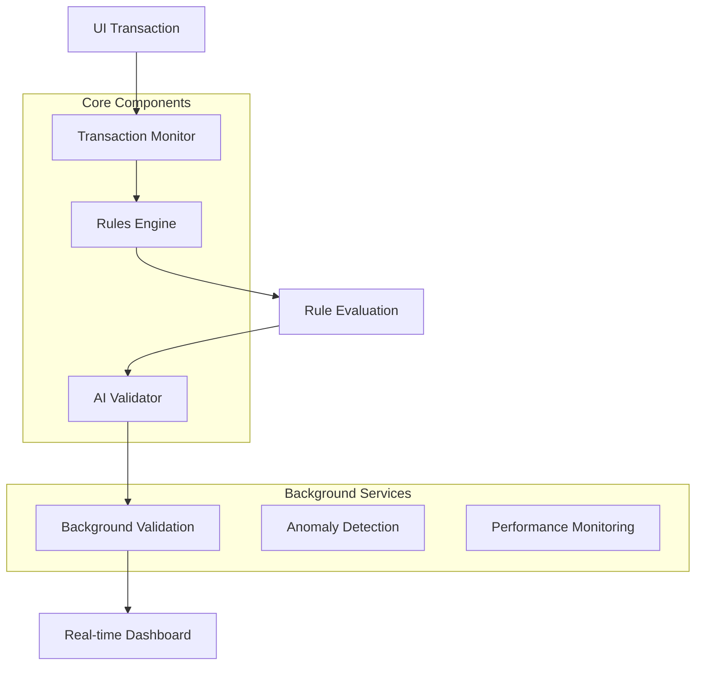

# 🤖 AI Rules Validator

An intelligent background agent system that validates rules engines in real-time, automatically monitoring UI transactions and providing comprehensive validation feedback.

## ✨ Features

### 🔍 AI-Powered Validation
- **Background Agent**: Continuously validates rules engine operations
- **Real-time Analysis**: Monitors rule execution performance and accuracy
- **Anomaly Detection**: Identifies unusual patterns and potential issues
- **Logic Validation**: Analyzes rule conditions for consistency and correctness

### ⚡ Automatic Transaction Monitoring  
- **UI Integration**: Automatically processes transactions from UI interactions
- **Queue Management**: Intelligent batching and prioritization
- **Real-time Processing**: Immediate rule evaluation with background validation
- **Retry Logic**: Robust error handling with configurable retry mechanisms

### 📊 Rules Engine
- **JSON-Based Configuration**: Easy-to-define rules in JSON format
- **Complex Conditions**: Support for nested logical operators (AND, OR, NOT)
- **Multiple Actions**: Execute various actions when rules trigger
- **Performance Optimization**: Efficient rule evaluation with metrics tracking

### 🎯 Rule Types Supported
- **Fraud Detection**: High-amount transactions, suspicious patterns
- **Geo-Risk Analysis**: Location-based risk assessment
- **Behavioral Monitoring**: User activity pattern analysis
- **Compliance Checks**: Blacklist validation, regulatory compliance
- **Device Security**: Suspicious device detection

## 🚀 Quick Start

### Installation

```bash
# Clone the repository
git clone <repository-url>
cd vibe-poc

# Install dependencies
npm install

# Start the server
npm start
```

### Development Mode

```bash
# Run with auto-reload
npm run dev

# Run AI agent separately
npm run agent
```

## 🏗️ Architecture



### Core Components

1. **Rules Engine** (`src/rules-engine/rule-processor.js`)
   - Converts JSON conditions to executable expressions
   - Evaluates rules against transaction data
   - Executes actions based on rule results

2. **AI Validation Agent** (`src/agents/ai-validator.js`)
   - Background validation of rule operations
   - Performance and accuracy monitoring
   - Anomaly detection and alerting

3. **Transaction Monitor** (`src/services/transaction-monitor.js`)
   - Monitors UI transactions automatically
   - Manages processing queues
   - Coordinates between rules engine and AI validator

4. **Web Server** (`src/server.js`)
   - Express.js API endpoints
   - WebSocket real-time updates
   - Static file serving for dashboard

## 📝 Rule Configuration

Rules are defined in JSON format with the following structure:

```json
{
  "id": "rule_identifier",
  "name": "Human Readable Name",
  "description": "Rule description",
  "enabled": true,
  "priority": "high|medium|low|critical",
  "category": "fraud_detection",
  "conditions": {
    "field": "amount",
    "operator": "greater_than", 
    "value": 10000
  },
  "actions": [
    {
      "type": "flag_transaction",
      "config": {
        "reason": "High amount transaction",
        "severity": "medium"
      }
    }
  ]
}
```

### Supported Operators

- `equals`, `not_equals`
- `greater_than`, `less_than`, `greater_than_or_equal`, `less_than_or_equal`
- `contains`, `not_contains`, `starts_with`, `ends_with`
- `in`, `not_in`
- `is_empty`, `is_not_empty`
- `date_before`, `date_after`, `date_between`

### Logical Operators

```json
{
  "and": [
    {"field": "amount", "operator": "greater_than", "value": 1000},
    {"field": "location.country", "operator": "equals", "value": "US"}
  ]
}
```

```json
{
  "or": [
    {"field": "user.isVIP", "operator": "equals", "value": true},
    {"field": "amount", "operator": "less_than", "value": 100}
  ]
}
```

### Action Types

- **flag_transaction**: Mark transaction for review
- **send_notification**: Send alerts to specified recipients  
- **calculate_score**: Compute risk scores
- **log_event**: Record events for audit
- **reject_transaction**: Block transaction

## 🔧 API Endpoints

### Transaction Processing
- `POST /api/transactions` - Submit transaction for processing
- `GET /api/transactions/:id` - Get transaction status
- `POST /api/test-transaction` - Process test transaction

### System Management
- `GET /api/health` - System health check
- `GET /api/stats` - System statistics
- `GET /api/validations` - AI validation history
- `GET /api/anomalies` - Detected anomalies

### Rule Management  
- `GET /api/rules` - Get current rules configuration
- `PUT /api/rules` - Update rules configuration
- `POST /api/validate-rule` - Manually validate specific rule

## 📊 Dashboard Features

The web dashboard provides:

- **Real-time Transaction Monitoring**: Live view of processed transactions
- **AI Validation Results**: Background validation status and results
- **System Statistics**: Performance metrics and health indicators
- **Interactive Testing**: Submit test transactions with custom parameters
- **Live Activity Log**: Real-time system events and notifications

Access the dashboard at `http://localhost:3000`

## 🔧 Configuration

### Environment Variables

```bash
PORT=3000              # Server port
HOST=localhost         # Server host
LOG_LEVEL=info         # Logging level (debug, info, warning, error)
RULES_PATH=./rules     # Path to rules configuration files
```

### AI Validator Options

```javascript
const aiValidator = new AIValidationAgent({
  validationInterval: 5000,        // Validation frequency (ms)
  maxConcurrentValidations: 3,     // Max parallel validations
  enableRealTimeValidation: true,  // Real-time validation
  logLevel: 'info'                 // Logging level
});
```

### Transaction Monitor Options

```javascript
const transactionMonitor = new TransactionMonitor(ruleProcessor, aiValidator, {
  autoProcessTransactions: true,   // Auto-process queued transactions
  batchSize: 10,                   // Processing batch size
  processingInterval: 1000,        // Processing frequency (ms)
  enableRealTimeProcessing: true,  // Real-time processing
  maxRetries: 3,                   // Max retry attempts
  retryDelay: 1000                 // Retry delay (ms)
});
```

## 🧪 Testing

### Sample Transaction

```javascript
{
  "amount": 15000,
  "userId": "user_123",
  "type": "transfer",
  "location": {
    "country": "US",
    "city": "New York"
  },
  "user": {
    "transactionCount24h": 5,
    "accountAge": 365,
    "isVIP": false
  },
  "device": {
    "isRecognized": true,
    "riskScore": 20
  }
}
```

### Running Tests

```bash
# Run all tests
npm test

# Test specific components
npm test -- --grep "Rules Engine"
npm test -- --grep "AI Validator"
```

## 📈 Monitoring & Metrics

### AI Validation Metrics
- **Validation Success Rate**: Percentage of passed validations
- **Average Execution Time**: Performance benchmarks
- **Error Rate**: Failed validation percentage
- **Anomaly Detection**: Unusual pattern identification

### Transaction Metrics
- **Processing Throughput**: Transactions per second
- **Queue Length**: Pending transactions
- **Success Rate**: Successful processing percentage
- **Average Processing Time**: Performance metrics

### System Metrics
- **Memory Usage**: Real-time memory consumption
- **CPU Usage**: System resource utilization
- **Uptime**: System availability
- **Connection Count**: Active WebSocket connections

## 🔒 Security Features

- **Input Validation**: Comprehensive transaction data validation
- **Security Pattern Detection**: Identification of potentially dangerous rule expressions
- **Data Sanitization**: Protection against injection attacks
- **Access Control**: API endpoint protection
- **Audit Logging**: Complete transaction and validation history

## 🚀 Production Deployment

### Docker Deployment

```dockerfile
FROM node:18-alpine
WORKDIR /app
COPY package*.json ./
RUN npm ci --only=production
COPY . .
EXPOSE 3000
CMD ["npm", "start"]
```

### Environment Setup

```bash
# Production environment variables
NODE_ENV=production
PORT=3000
LOG_LEVEL=warning
ENABLE_CORS=true
RULES_PATH=/app/rules
```

### Scaling Considerations

- **Horizontal Scaling**: Multiple server instances
- **Load Balancing**: Distribute transaction processing
- **Database Integration**: Persistent rule and transaction storage
- **Message Queues**: Asynchronous processing with Redis/RabbitMQ
- **Monitoring**: Integration with APM tools (New Relic, DataDog)

## 🤝 Contributing

1. Fork the repository
2. Create feature branch (`git checkout -b feature/amazing-feature`)
3. Commit changes (`git commit -m 'Add amazing feature'`)
4. Push to branch (`git push origin feature/amazing-feature`)
5. Open Pull Request

## 📄 License

This project is licensed under the MIT License - see the [LICENSE](LICENSE) file for details.

## 🆘 Support

For support and questions:

- 📧 Email: support@company.com
- 📱 Issues: GitHub Issues
- 📖 Documentation: `/docs` directory
- 💬 Discussions: GitHub Discussions

---

**Built with ❤️ for intelligent transaction monitoring and validation** 